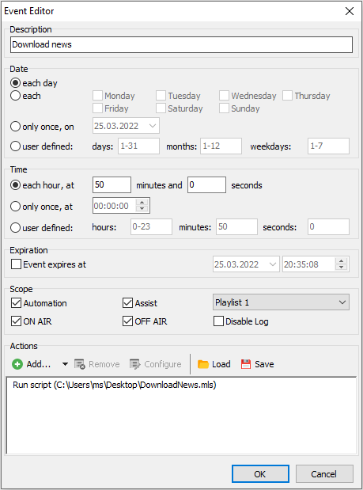

---
title: "Downloading from FTP with a script"
date: "2022-03-25"
author: "Thomas Mongstad"
description: "Script for downloading files from FTP?"
tags: ["mAirlist","Script"]
draft: false
--- 
Our newsprovider are uploading every hour to their FTP server for us to download and use.  
At their server the filename is: Nyheter_2022-03-25_20  
(News_year-month-date_hour)

``` pascal
const  
    URL = 'ftp://**username**:**password**@*ftp1.newsprovider.dev*/*Filename_*';
var
    TIME: string;
begin
    SystemLog('Downloading news.');
    // Adding approx. 15 minutes to the current time, as we are downloading at 10 minutes to the hour.
    TIME := FormatDateTime('yyyy-mm-dd_hh', Now + 0.00555555);
    ShellExecuteHidden('curl', URL + TIME +'.wav --output M:\Database\Nyheter\nyheter.wav');
end.    
```
Just add this to your mAirlist event edior :)  
  

Feel free to send me a chat at @mongstad:matrix.org if you have any questions or feedback!  
[Maybe buy me a coffee?](https://www.buymeacoffee.com/mongstad) 