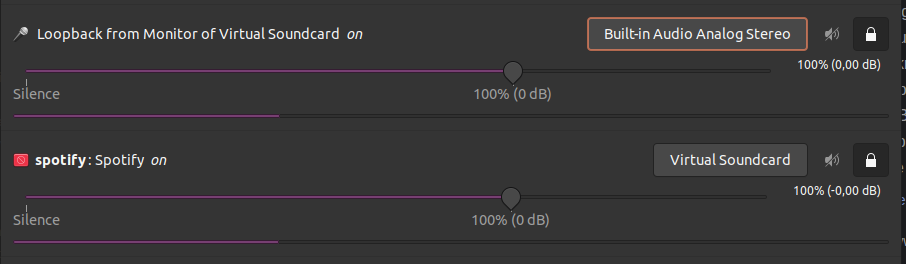

Most of my systems are running debian based distros. Here's a quick guide on how to create virtual audio cables using Pulse Audio.

First make sure that Pulse Audio Volume Control (pavucontrol) is installed.

```bash
sudo apt install pavucontrol
```

Once this is installed copy the default configuration to your config folder.

```bash
# First create the config folder
mkdir ~/.config/pulse

# Then copy the default.pa file
cp /etc/pulse/default.pa ~/.config/pulse/default.pa

# Add the following lines to the end of this file.
# Multiple "cables" may be added.
# Note the sink_name which will need to be updated thoughout all the lines!

### Virtual Sound Card
load-module module-null-sink sink_name=THENAME
update-sink-proplist THENAME device.description="Virtual Soundcard"
update-source-proplist THENAME.monitor device.description='Monitor of Virtual Soundcard'
load-module module-loopback source=THENAME.monitor latency_msec=1
```

If you have trouble with the virtual card doesn't start on boot, you may need to add the below to the last line of `default.pa`
```bash
load-module module-switch-on-connect
```

To route the audio to your new virtual audio cable, start PulseAudio Volume Control, and chose the output for the specified application. 

To listen on the speakes, set the loopback feed to your speakers.




Hope this quick guide was to any help :) 
I've been using this to seperate applications which I want to broadcast using butt or discord, but don't want to output to my speakers whilst broadcasting.

Feel free to send me a chat at @mongstad:matrix.org if you have any questions or feedback!  
[Maybe buy me a coffee?](https://www.buymeacoffee.com/mongstad)
